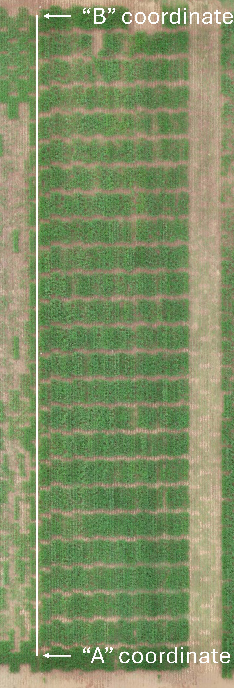
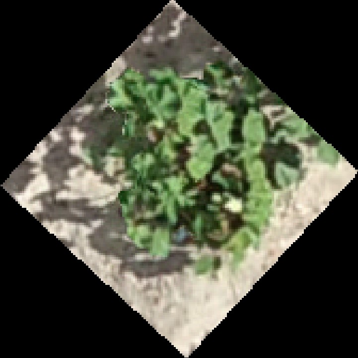
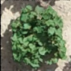

## Distributional Data Analysis Uncovers Hundreds of Novel and Heritable Phenomic Features from Temporal Cotton and Maize Drone Imagery

This repository serves as a supplementary data source for our manuscript that introduces the concept of distributional data analysis for agricultural research and will be updated throughout the preprint and publication process.
All analyses mentioned in the paper are included below as RMarkdown documents. Files needed to run the RMarkdown scripts are included in the `R_files` folder. Files needed to run the python scripts are included in the `Python_files` folder.

Our preprint can be found at [this biorxiv link](https://www.biorxiv.org/content/10.1101/2025.09.05.674557v1).

### Notes regarding raw data
In total, this manuscript relied upon several terabytes of files, between raw drone images, orthomosaics, and CSV files that contain the distributional quantile data (the raw quantile data from all G2F locations was a 58 gigabyte file alone, excluding columns for information like genotype, range, row, replicate)! As such, we simply cannot store all of this data on GitHub. The scripts provided below will allow readers to reproduce the analyses in the paper and generate the CSV files that are required to produce the figures from which conclusions in the paper are drawn. For the section that details extracting distributional data from orthomosaics: the orthomosaics, shapefiles, and raw drone images are in the process of being uploaded to the [Data 2 Science website](https://ps2.d2s.org/) hosted by Purdue University and created by [Dr. Jinha Jung](https://engineering.purdue.edu/CCE/People/ptProfile?resource_id=222078).

## Menu
[1 - Python setup - creating a conda virtual environment from a .yml file](#installation)

[2 - Shapefile creation from a CSV file](#p2)

[3 - Image extraction from orthomosaics](#p3)

[4 - Soil masking](#p4)

[5 - Extraction of standard VIs and distributional data](#p5)

[6 - Mixed function-on-scalar distributional regression model for phenomic data](#p6)
     
[7 - Yield prediction and feature importance quantificaiton with maize distributional data](#p7)
     
[8 - Correlation analysis of maize quantile phenomic data](#p8)

[9 - Visualization of raw data](#p9)

[10 - Calculation and visualization of heritability](#p10)

<br />

<div id="installation" />

### 1 - Python setup - creating a conda virtual environment from a .yml file
All of the libraries required to use our python scripts are included in the file `Python_Phenomics.yaml` stored in the `Python_files` directory. First, download Anaconda Navigator if you haven't already done so, and then launch Anaconda Prompt. From the console, navigate to the directory where you downloaded the yaml file and set up an Anaconda virtual environment using the file. An example (Windows) would look like this:

`cd C:\Users\aaron.desalvio\Downloads`

`conda env create -f Python_Phenomics.yaml`

Once the installation is complete, activate the environment. If you want to use the Spyder IDE, simply type `spyder` after activating the environment and it will launch.

`conda activate Python_Phenomics`

<br />

<div id="p1" />

### 2 - Shapefile creation from a CSV file
To create a shapefile, use the `create_shapefile_from_csv()` function within the `Create_Shapefile.py` script. A CSV file with unique plot IDs (or single plant IDs) must be provided to the function for it to work. I find it easiest to concatenate the X and Y coordinate columns together. In the example below, we've concatenated the Range (Y axis) and Row (X axis) identifiers to make the `Range_Row` column. An example usage of the function is as follows:

```python
csv_path = 'C:/Users/aaron.desalvio/Documents/TESTING/Python_Phenomics/RGB_G2F_2024'
output_path = 'C:/Users/aaron.desalvio/Documents/TESTING/Python_Phenomics/RGB_G2F_2024/Shapefiles'

gdf = create_shapefile_from_csv(
    csv_file=os.path.join(csv_path, 'CS24_G2F_Plots.csv'),
    shapefile_output=os.path.join(output_path, '20240501_G2F_V2.shp'),
    A=(746593.958,3381859.705),
    B=(746723.366,3381741.565),
    ft_toggle=0.3048,
    rangelength=25,
    rangebuffer=2,
    rowwidth=5.04,
    rowbuffer=0.3,
    utm_epsg=32614,
    plot_id_colname='Range_Row',
    range_colname='Range',
    row_colname='Row',
    remap_rows=True,
    shift_rows_to_one=True
)
```
`csv_path` and `output_path` indicate the paths where the initial CSV file is stored and the location where you'd like to save the resulting shapefile, respectively.
"A" and "B" indcate the coordinates of the "AB line", which provides a line that the function will use to specify the angle of each component of the shapefile. Examples of where to obtain the AB coordinates in an orthomosaic could look like:
<p align="center">
  
</p>
To obtain the exact coordinates, load an orthomosaic in QGIS and right click. A dialog box saying `Copy coordinate` will appear - make sure to copy coordinates in the specific UTM zone your orthomosaic was exported in. In the case of this example, we are in UTM zone 14N with an EPSG code of 32614.

`ft_toggle` should be set to 0.3048 if your plot measurements are in feet. If your measurements are in meters, set this parameter to 1.

`rangelength` indicates the TOTAL available length of the range (the Y axis direction of the plot). The `rangebuffer` parameter indicates the reduction in length on ONE side of the plot. If the `rangebuffer` parameter is 2 feet, there will be a total of 4 feet trimmed from the plot's length when you account for both sides. In the figure below, the range length was 25 feet, but a buffer of 2 feet on each side allows people to walk between plots to take notes (please forgive the checkerboarding pattern of the plots). Also, note the IDs of the plots: range concatenated to row with an underscore. `rowwidth` follows the same logic in the X direction - it is the TOTAL available witdth of the plot, and `rowbuffer` is the reduction in width on ONE side of the plot. In the example below, the total row width was 5.04 ft and the buffer between rows was 0.3 ft (3.6 in).
<p align="center">
  
</p>

`utm_epsg` is the EPSG code that your orthomosaic (and thus shapefile) are saved in. A great resource for determining which UTM zone your data are in can be found at [this link](https://mangomap.com/robertyoung/maps/69585/what-utm-zone-am-i-in-). If you search for College Station, TX, you'll see that we're in UTM zone 14N, which correponds to an EPSG code of 32614.

`plot_id_colname` indicates the name of the column in your CSV file that contains the unique identifers of each plot or plant. For this example, that was the `Range_Row` column (the concatenation of the X and Y axis identifiers of each plot).

`range_colname` and `row_colname` are the column names of the Y and X axes of your field layout, respectively.

`remap_rows` is a True/False argument that applies to field designs in which plots consist of more than one row. In the image above, note that each plot contains two rows of maize. In summary, if this is set to "True", the function will take in odd- or even-numbered row names (such as 1, 3, 5) and remap them to consecutive integers (1, 2, 3).

`shift_rows_to_one` is a parameter designed for breeding programs or research programs with multiple field experiments that may be planted next to each other. If set to "True", it will shift the values within row_colname (the X axis of the field) so that the smallest value becomes 1. For example, if the first row starts at 300, the first time you visualize a newly-created shapefile in QGIS, it will appear far off to the right of where the A coordinate is in the AB line. Setting this parameter to "True" will make it so that the rows that begin with a number other than 1 (e.g., 300, 301, 302) will be remapped to (1, 2, 3), placing the first plot much closer to the A coordinates of the AB line. We recommend making manual adjustments to shapefiles in QGIS. Each shapefile should be saved with a unique identifier that contains the date. For example, two shapefiles in this field could be named 20240503_G2F.shp and 20240504_G2F.shp. Keeping a consistent base name (e.g., _G2F.shp) enables efficient processing in downstream loops.

<br />

<div id="p2" />

### 3 - Image extraction from orthomosaics
After aligning each shapefile for each flight date, the `crop_regions_from_ortho()` function enables extraction of individual experimental units from orthomosaics. An example implementation of the function is detailed below:

```python
flight_list  = ['20240705', '20240706', '20240707']
shp_folder = 'C:/Users/aaron.desalvio/Documents/TESTING/Python_Phenomics/RGB/Shapefiles'
shp_base = '-CS24-STEL-RGB-RTK.shp'
tif_folder = 'C:/Users/aaron.desalvio/Documents/TESTING/Python_Phenomics/RGB'
tif_base = '-CS24-STEL-RGB-RTK.tif'
output_path = 'C:/Users/aaron.desalvio/Documents/TESTING/Python_Phenomics/RGB/Cropped'
plot_id_colname = 'Range_Row'

# Use the function
crop_regions_from_ortho(
    flights=flight_list,
    shp_folder=shp_folder,
    shp_base=shp_base,
    tif_folder=tif_folder,
    tif_base=tif_base,
    output_path=output_path,
    plot_id_colname=plot_id_colname)
```
`flight_list` is a list of dates. `shp_folder` is a path to the folder that contains the shapefiles.

`shp_base` is the unchanging portion of the file name in each shapefile. In this exmaple with the cotton data from our paper, each orthomosaic contained `-CS24-STEL-RGB-RTK.shp` as the base portion of the file with the date attached at the beginning of the file for each day the drone was flown.

`tif_folder` is the path to the folder containing the orthomosaics. `tif_base` follows the same logic as `shp_base`.

`output_path` is the directory where you'd like to save the cropped images - it's recommended to contain the images in their own folder to keep them away from other files you need to access frequently in your project.

`plot_id_colname` is the column name of the unique plot identifier in your shapefile. ESRI shapefiles are essentially data frames - this is the column name in that data frame that allows differentiation between plots. If you can't remember what this name is, drag and drop your shapefile into QGIS, right click on its name in the "Layers" tab, then open the "Attributes Table". This will allow you to view all the columns present in the shapefile. An example of a cropped cotton image looks like the following:
<p align="center">
  
</p>

#### Removal of excess black background from cropped images
This is an optional step that can be useful if the cropped images are going to be used directly as input data for a deep learning model. If not, this step does not need to be performed. The image above shows large portions of black background that were added during the plot cropping step. This is a consequence of working with GeoTIFFs as the spatial orientation of the plots is retained and the image saving step pads the image with black pixels to produce a square or rectangular output. The vegetation index extraction step will ignore these black pixels automatically, but if you prefer the images to look cleaner and/or to use them as direct inputs later, the next step is useful. An example implementation is demonstrated below.
```python
images_to_crop = 'C:/Users/aaron.desalvio/Documents/TESTING/Python_Phenomics/RGB/Cropped'
clean_images_out = 'C:/Users/aaron.desalvio/Documents/TESTING/Python_Phenomics/RGB/Cropped_Clean'
output_file_type = '.tif'

crop_ROI(
    images_to_crop=images_to_crop,
    clean_images_out=clean_images_out,
    output_file_type=output_file_type)
```
Note that the export directory from `crop_regions_from_ortho()` has become our input directory for `crop_ROI()`. The `clean_images_out` directory specifies where you'd like to save images that have had the excess black background pixels removed. After using this function, plots or plants will look similar to this:
<p align="center">
  
</p>

<br />

<div id="p3" />

### 4 - Soil masking
Soil masking is a difficult undertaking and we by no means claim to have the perfect solution to this problem. We use vegetation indices to create binary masks for segmenting plant vs. soil pixels using previously published indices such as the [HUE index](https://github.com/OpenDroneMap/FIELDimageR) and the [ExG index](https://www.mdpi.com/2072-4292/12/11/1748). We fully acknowledge that more robust methods likely exist, and still need to be developed, particularly at the onset of senescence when the segmentation threshold often mistakes senesced plant tissue with soil.

#### RGB soil masking
```python
input_images = 'C:/Users/aaron.desalvio/Documents/TESTING/Python_Phenomics/RGB/Cropped_Clean'
masks_out = 'C:/Users/aaron.desalvio/Documents/TESTING/Python_Phenomics/RGB/Masks'
masked_images_out = 'C:/Users/aaron.desalvio/Documents/TESTING/Python_Phenomics/RGB/Masked_Images'

# If specifying your own vegetation index, create it within a dictionary and pass this to the function:
# As an example, the HUE index from FIELDimageR is given here. In this case, the value of the threshold
# parameter should be set to 0.7 and the comparison parameter should be set to 'greater'
my_index = {'HUE': lambda R,G,B: np.arctan(2*(B-G-R)/30.5*(G-R))}


process_and_save_masks(input_images,
                       masks_out,
                       masked_images_out,
                       threshold=0.1,
                       index_name='ExG',
                       comparison='less',
                       custom_indices=None,
                       output_type='.tif')


process_and_save_masks(input_images,
                       masks_out,
                       masked_images_out,
                       threshold=0.7,
                       index_name='HUE',
                       comparison='greater',
                       custom_indices=my_index,
                       output_type='.tif')
```
The function's default is to use the ExG vegetation index for segmentation. By default, values below a 0.1 are marked as soil pixels. The `comparison` argument specifies whether pixels above (`greater`) or below (`less`) the threshold should be marked as soil pixels.

If you'd like to use your own index and override the default, create a python dictionary with the name of the index and its formula. In this case, the only available bands are red, green, and blue. An example of manually defining the HUE index is shown in the code snippet above. When specifying your own index, the `custom_indices` parameter must be set to the dictionary you created and the `index_name` must be the name of the index in that dictionary.

#### Multispectral soil masking
Working with multispectral images (with bands beyond the standard RGB) required us to create a separate function due to the fact that different sensors can capture different bands, often not saving them in the same order. Two example implementations of the multispectral version of the masking function are shown below:
```python
input_images = 'C:/Users/aaron.desalvio/Documents/TESTING/Python_Phenomics/MULTI/Cropped'
masks_out = 'C:/Users/aaron.desalvio/Documents/TESTING/Python_Phenomics/MULTI/Masks'
masked_images_out = 'C:/Users/aaron.desalvio/Documents/TESTING/Python_Phenomics/MULTI/Masked_Images'
my_band_map = {'B':0, 'G':1, 'R':2, 'RE':3, 'NIR':4}

# Use the default masking vegetation index (ExG)
process_and_save_masks_multi(
                           input_images=input_images,
                           masks_out=masks_out,
                           masked_images_out=masked_images_out,
                           threshold=0.1,
                           index_name='ExG',
                           comparison='less',
                           custom_indices=None,
                           output_type='.tif',
                           band_map=my_band_map)

# Use a custom masking vegetation index (HUE)
my_index = {'HUE': lambda R,G,B: np.arctan(2*(B-G-R)/30.5*(G-R))}
process_and_save_masks_multi(
                           input_images=input_images,
                           masks_out=masks_out,
                           masked_images_out=masked_images_out,
                           threshold=0.7,
                           index_name='HUE',
                           comparison='greater',
                           custom_indices=my_index,
                           output_type='.tif',
                           band_map=my_band_map)
```
The most crucial parameter here is `my_band_map`. This is a python dictionary that enables the user to specify the name and the order of each band. In the band map provided in this example (corresponding to a DJI Phantom 4 Multispectral orthomosaic that was exported with Agisoft Metashape), the band order is Blue, Green, Red, RedEdge, NIR. Note that python uses zero indexing, so the first band is specified with 0, the second with 1, etc. The logic for this function is the same as with the RGB-only function - a custom index can be provided by specifying a dictionary and feeding into the `custom_indices` argument.


### Extraction of distributional data from orthomosaics

### Cotton Distributional Data Analysis - R Scripts
"AM" indicates "ANOVA Model", and "HM" indicates "heritability model" (see Table 1 in the paper)
- $\textbf{ANOVA to quantify Genotype × Time interaction with median VIs}$: [AM1 / HM1](https://rpubs.com/ajdesalvio/cotton_maize_anova1)
- $\textbf{ANOVA to quantify heritability and Genotype variance for each time point with median VIs}$: [AM2 / HM2](https://rpubs.com/ajdesalvio/cotton_maize_anova2)
- $\textbf{ANOVA to quantify heritability and Genotype variance for each quantile WITHIN time point}$: [AM3 / HM3](https://rpubs.com/ajdesalvio/cotton_maize_anova3)
- $\textbf{ANOVA to quantify Genotype × Time interaction at each quantile level}$: [AM4 / HM4](https://rpubs.com/ajdesalvio/cotton_maize_anova4)
- $\textbf{ANOVA to quantify Genotype × Quantile interaction at each time point}$: [AM5 / HM5](https://rpubs.com/ajdesalvio/cotton_maize_anova5)

### Distributional Data Analysis - Python Scripts

See the `RMarkdown` folder for the RMarkdown files used to generate each RPubs document.
